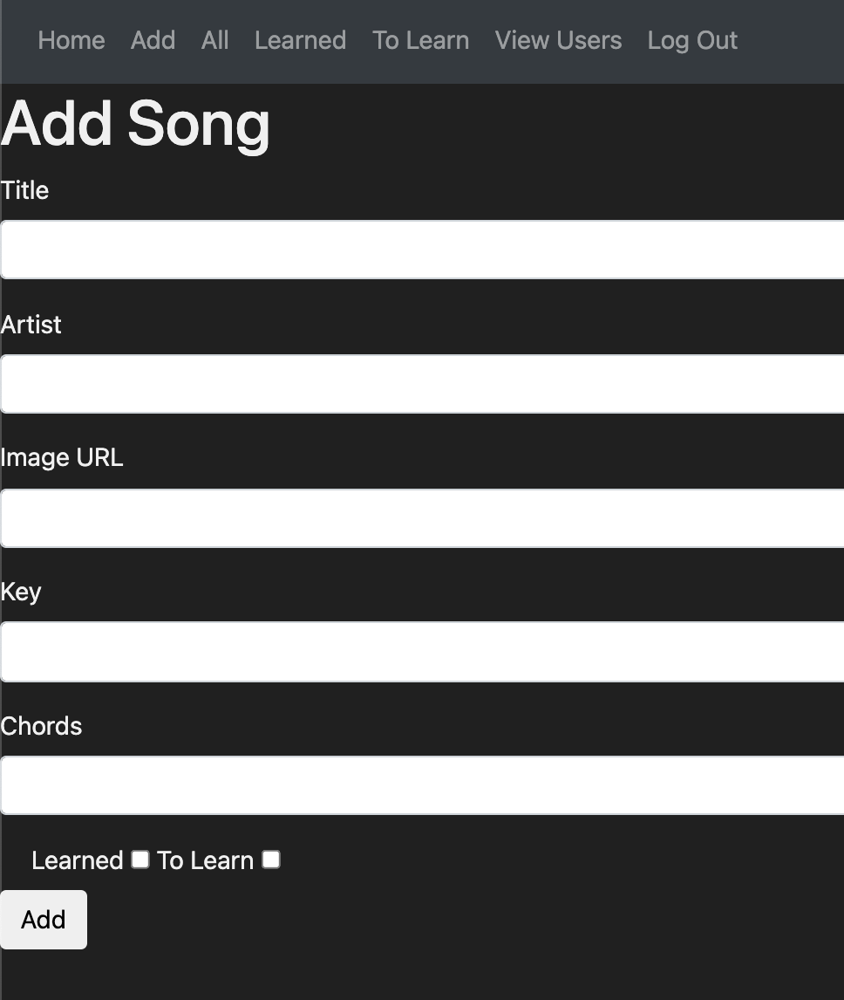
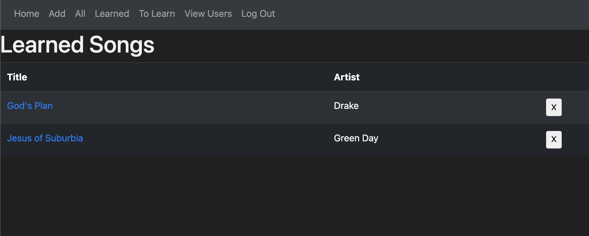

# Song Tracker

An app that lets you track songs you've learned, want to learn, or just want to save. This app is incredibly useful for experienced and casual musicians alike. As a guitar player, I've always wanted an app that makes it easy to store song chords (for covers or originals) and lets you add comments. Finally, I have the tool I've been looking for. I hope you find this as useful as I do. Rock on my friends!

## Getting Started
Link to app: https://song-tracker-app.herokuapp.com/

Link to Trello planning: https://trello.com/b/qFcVH00F/unit-2-project
## Instructions

Use the navigation bar at the top to:
* Add a song
* View all your songs
* View your learned songs
* View songs you want to learn

    
To view the chords of a song, click on the song title.
## Technologies Used

Express, MongoDB, Google OAuth, Bootstrap, HTML, CSS, and Javascript.

## Next Steps

Add an API to a music website so the artwork for the song can be automatically added whenever you add a new song.
